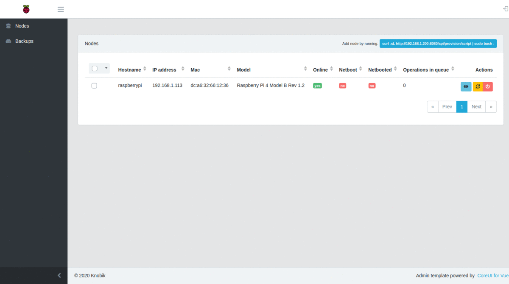

**!!! This software is in alpha stage, i dont recommend using it in production !!!**



# About
Ever wanted to just install a new system or backup your RPi4 node in your cluster without the hussle of pulling the sd card out, flashing it on a PC and putting it back in? This is exacly the reason i started this. Awsome raspberry pi cluster management software you can host on your PC, server or one of your nodes.

This software is designed with RPi4 and CM4 in mind, but can also work with RPi3 and older. Just not all features will be available (boot order change, needs to be done manualy).

# Features
* Manage pi cluster inventory, status, etc (TODO: export to ansible)
* Reboot / Shutdown nodes remotely
* Netboot node for recovery
* Backup / Restore node
* Easy reinstall through netboot, without removing sd card or usb device.
* Change boot order (only RPi4+)
* Tested on `Raspberry Pi OS`, `Ubuntu`

## For updates see [CHANGELOG.md]
[CHANGELOG.md]: CHANGELOG.md

# Quick start

```
docker run -d -v ~/data:/.data -v ~/backups:/nfs/backups --privileged --network host knobik/rpicloud
```

 * `--privileged` is needed to have control over nfs kernel module and loop devices for mounting the base image. 
 * `--network host` simplifies network configuration for the `dhcp`, `tftp`, `nfs`, `http` services.

Login to web UI:
```
login: admin@example.com
password: admin
```


### Node setup
Set RPi4 boot order by editing the [eeprom settings](https://www.raspberrypi.com/documentation/computers/raspberry-pi.html#raspberry-pi-4-bootloader-configuration). Netboot then sd / usb boot order. (i use `BOOT_ORDER=0xf132` which means `netboot -> usb -> sdcard -> restart`, to boot faster you can also set `DHCP_TIMEOUT=5000` and `DHCP_REQ_TIMEOUT=500`).

This is simplified by a boot order change tool for RPi4 in our software. RPi3 and older need to be [hand configured for netboot](https://www.raspberrypi.com/documentation/computers/raspberry-pi.html#raspberry-pi-2b-3a-3b-cm-3-3).

# Development

### Requirements
* Docker version 19.03 or newer
* docker-compose version 1.25 or newer 

### Setup
Clone the repository and build the image
```
git clone git@github.com:knobik/rpi-cluster-pxe.git
chmod +x build-dev.sh
bash ./build-dev.sh
docker-compose up
```

This will take a while, it needs to download all php and node dependencies and also download the latest raspberry pi os and set it up for pxe booting.

All operations are made inside the docker container, so you need to ssh into the container. You can do it easy with `./ssh.sh`

### Frontend development
```
$ cd /web && npm run dev
```

Hot reloaded frontend: `http://localhost:3000`

### Backend development
```
$ cd /api
```

### Side notes
* One netbooted PI at a time, booting multiple PI's from one image might corrupt the image or lead to operation errors.
* In the background, `dd` is used to make an img of your sd card and then a script is used to resize it so each backup doesnt take 16/32+ GB of space ;) This means you need atleast as much free space on your host as the size of your sd card / usb drive.

### Todo
- [X] Validate free disk space before making a backup 
- [ ] User management (now the user is admin@example.com, we need to change that!)
- [ ] Export inventory to ansible
- [ ] Multiple netboot images, preferably one per node or a netboot pool. (maybe, each netboot image takes atleast 3GB+ of disk space)****
